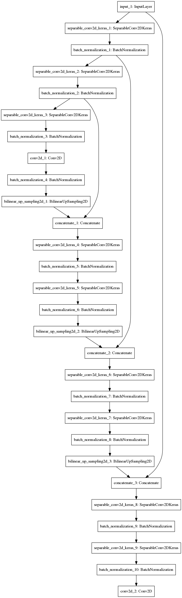

## Deep Learning Project(Follow me) ##

In this project, I will train a deep neural network to identify and track a target in simulation. So-called “follow me” applications like this are key to many fields of robotics and the very same techniques i apply here could be extended to scenarios like advanced cruise control in autonomous vehicles or human-robot collaboration in industry.

**FCN Model**

FCN model comprise of 3 parts: encoder block, 1x1 convolution, decoder block.  
The structure of the model for this project is: 3 encoder blocks + 1x1 conv block + 3 decoder blocks.

1. Encoder block comprise of a separable convolution layer and a batch normalization layer, with kernel=3, strides=2 for the convolution layer.
  * I used 3 encoders for this project, with filters(depth)=32, 64, 128 respectively.
  * This 3 encoders is to extract features from the input.
2. 1x1 convolution part comprise of a regular convolution layer and a batch normalization layer, with kernel=1, strides=1 for the convolution layer.
  * This layer is a cheap way to increase the depth of the encoder output, it's kind of doing a similar work to the full connected layer in classification models but keeping the spatial information instead.
  * I used filters(depth)=256 for this layer.
3. Decoder block comprise of a bilinear upsampling layer, a concatenation layer, and 2 separable convolution layers.
  * I used 3 decoders for this project.
  * The bilinear upsampling is with a factor of 2, which means double width and height of feature map each time.
  * Then the upsampling output will be concatenated with a prior(a bigger scale perspective) layer from encoder layers. This step is similar to a skip connection, applying a bigger scale perspective to the decoder.
  * For each decoder block, i added 2 additional separable convolution layers to extract more spatial information from that prior layer. The filters are 128, 64, 32 respectively.
4. Finally, the output of the last decoder will be applied to a regular convolution layer to make the classification.  

Here is the structure:

**Parameters**

Here are the parameter used in this project.

* learning_rate = 0.001
  - I tried 0.0001, and found it's very slow to down the loss. It means i got almost a straight line with a low slope during 30 epochs. The speed is too slow.
  - Then i tried 0.001, the loss down to around 0.03 in the first 5 epochs. That's ok.
* batch_size = 64
  - My GPU is nVidia GTX 1070, so 64 is the max size of 2's exponent. I tried 128, the memory crashed...
* num_epochs = 30
  - Look at the loss-epoch plot, the loss is down to around 0.02 in 10 epochs.
  - I guess 10 is ok, but if i train more epochs, it will still get some better performance.
  - I kept 30, it's a little better than 10.
* steps_per_epoch = 200
  - 200 * (batch_size = 64) is able to cover all the train images(4131 images).
  - 200 is capable for my GPU, so i kept this value.
* validation_steps = 50(similar to steps_per_epoch)
  - 50 * (batch_size=64) is able to cover all the validation images(1184 images).
* workers = 2

**Techniques**

1. 1x1 convolution is almost used to connect the encoder block and decoder block in FCN.
2. A fully connected layer is almost used in the final couple of layers in classification models. These models is to classify the entire image to say which class it is.
3. A fully connected layer is doing some math calculations on the entire feature to try to extract some helpful informations for the classification task.
4. 1x1 convolution is also trying to extract helpful information for classification, but not on entire feature, instead using a convolution operation to keep the spatial information.

**Image Manipulations**

The image manipulations are all included in `data_iterator.py`:
1. Resize to the shape of input of the model.
  * Keep the model suitable to any size of input images.
  * It would lose fidelity when the size of input image is very different from the shape of the model input.
2. Pre-process: `x = (x/255 - 0.5) * 2.`(normalization)
  * This is normalization: 0-mean, equal-variation.
  * Help gradient descent work well so the network converge more quickly.
  * Help use a higher learning rate.
  * Help avoid value overwhelming.

**Limitations**

1. This model is trained on only 3 classes: hero, other people, the background. It's limited to identify this 3 kind of objects, precisely 2 kind: hero and other people, since the third class is for anything not be that 2 kind. The encoder don't know what features to extract if it's used on other objects, like dogs, cats, car etc. It would fail to identify all the other objects except that exact 3 kind.
2. The train data for now is not sufficient yet, so the final score is around 40%. It's just ok to follow a hero in such a simplified scenario, but never stood a chance to the real world.
3. A realistic way to construct a real world FCN model, is to use a pre-trained model on a large dataset, such as VGG, ResNet and etc. as the encoder. (I have done this before in the self-driving car ND classes).

**Future Enhancements**

* Like i said in 'Limitations', it's a good way to use a pre-trained model as the encoder. Because this model knew how to extract features for a large scale object types.
* With talking about this specific project, i guess what i need to do to improve the performance is to collect more data, especially on scenarios while the hero is far away.
